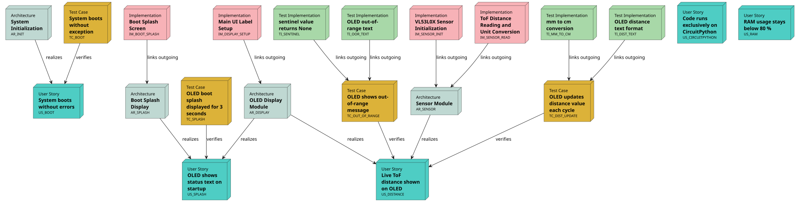
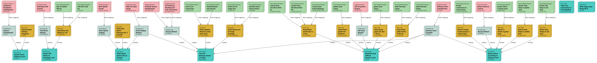

# Demo: Park Assist

> **Repository:** [github.com/useblocks/demo_park_assist](https://github.com/useblocks/demo_park_assist)

## Workshop

This repository was created for a workshop held at the Sphinx-Needs user group meeting.

The workshop combines **CircuitPython firmware** development with **sphinx-needs documentation** and **GitHub Copilot** assisted coding. Participants work through five progressive steps, each adding a new hardware feature — driven first by documentation (User Stories → Architecture → Test Cases) and then implemented with AI assistance.

### Workshop Steps

| Step | Make target | Starting state | Task | New feature |
|------|-------------|---------------|------|-------------|
| Setup | — | Empty board | Flash CircuitPython, deploy code | OLED shows distance |
| 1 | `make step_start` | Display works | Explore docs & ubCode | — |
| 2 | `make step_2` | Display works | Fix traceability, schemas, missing tests | Correct link graph |
| 3 | `make step_3` | Display works | Add buzzer — docs first, then code | Continuous beep at < 20 cm |
| 4 | `make step_4` | Display + buzzer | Add LED strip | Red < 20 cm, green otherwise |
| 5 | `make step_5` | Display + buzzer + simple LED | Add zone logic | 4 proximity zones, dynamic LED count |
| Bonus | `make step_bonus` | Step 5 complete | Install Pharaoh, analyse requirements with AI | MECE check, traceability trace, change impact analysis |

Each step has a dedicated guide:
- [WORKSHOP_1_START.md](WORKSHOP_1_START.md) – Setup & first exploration
- [WORKSHOP_2_DOCS.md](WORKSHOP_2_DOCS.md) – Traceability, schemas & Copilot fixes
- [WORKSHOP_3_BUZZER.md](WORKSHOP_3_BUZZER.md) – Buzzer: docs-first development
- [WORKSHOP_4_LED.md](WORKSHOP_4_LED.md) – LED strip: docs-first development
- [WORKSHOP_5_ZONES.md](WORKSHOP_5_ZONES.md) – Dynamic 4-zone proximity system
- [WORKSHOP_BONUS_PHARAOH.md](WORKSHOP_BONUS_PHARAOH.md) – Pharaoh: AI-assisted requirements engineering

Use `make step_<N>` to jump to any stage or recover a clean baseline.
Targets can be combined — e.g. `make step_3 clean open` switches state, clears the build cache and opens the docs.

### Needflow: step\_start vs. step\_5

The needflow diagram in `docs/index.rst` shows the end-to-end traceability graph connecting User Stories → Architecture → Implementation → Test Cases.
Below is the comparison between the starting state (distance only) and the fully completed project:

**step\_start** — only the distance feature is documented:



**step\_5** — all features (distance, buzzer, LED strip, zone logic) are fully traced:



---

This README covers the technical setup and implementation details.

## Introduction


A CircuitPython demo that simulates a car park assist system. A VL53L1X Time-of-Flight sensor measures the distance to an obstacle; the result is visualised on a 1.3" SH1106 OLED display and reflected on a NeoPixel LED strip (green → yellow → red as the obstacle gets closer). An audible buzzer warns at short range. Everything runs on an Adafruit Metro board with CircuitPython.

The project has two hardware setups:
- **Setup 1 (Prototype):** Adafruit Metro M4 Express + VL53L1X ToF sensor
- **Setup 2 (Workshop, ×5 units):** Adafruit Metro RP2040 + VL53L0X ToF sensor

## Getting Started

### 1. Prepare the hardware

Wire the board (I2C bus, GPIO) as described in [hw.md](hw.md):

| Component | Interface | Pins |
|-----------|-----------|------|
| VL53L1X ToF sensor | I2C | `SCL` / `SDA` |
| SH1106 OLED (128×64) | I2C | `SCL` / `SDA` |
| NeoPixel strip (60 LEDs) | GPIO | `D2` |
| Buzzer 1 | GPIO | `D5` |
| Buzzer 2 | GPIO | `D6` |

The VL53L1X sensor and the OLED share the I2C bus at different addresses (sensor `0x29`, display `0x3C`).

### 2. Flash CircuitPython

If CircuitPython is not yet running on the board:

1. Connect the board via USB-C and **double-press** the reset button until the board appears as the `METROBOOT` drive.
2. Copy the appropriate `.uf2` file from `util/` onto the drive:
   - Metro M4 Express → `adafruit-circuitpython-metro_m4_express-en_US-10.1.3.uf2`
3. The board reboots automatically and then appears as the `CIRCUITPY` drive.

### 3. Install libraries

The required libraries are already bundled under `src/lib/` and just need to be copied to the board:

```
src/lib/ → CIRCUITPY/lib/
```

Newer versions can alternatively be taken from the included Adafruit bundle at `util/adafruit-circuitpython-bundle-10.x-mpy-*/lib/`.

### 4. Deploy the code

Copy all files from `src/` to the root of the `CIRCUITPY` drive:

```
src/boot.py  → CIRCUITPY/boot.py
src/code.py  → CIRCUITPY/code.py
src/lib/     → CIRCUITPY/lib/
```

The board runs `boot.py` once at startup and then executes `code.py` automatically. Any save to `code.py` triggers an immediate restart.

### 5. Open a serial monitor (optional)

For debug output, open a serial monitor (e.g. [Mu Editor](https://codewith.mu/) or `screen /dev/ttyACM0 115200`). REPL access is enabled via `boot.py`.

---

## Where to find information

| Topic | File |
|-------|------|
| Hardware components, wiring, and pin assignments | [hw.md](hw.md) |
| Software requirements, architecture, and open tasks | [sw.md](sw.md) |
| Main application code | [src/code.py](src/code.py) |
| Boot configuration | [src/boot.py](src/boot.py) |
| CircuitPython libraries | [src/lib/](src/lib/) |
| CircuitPython firmware and Adafruit bundle | [util/](util/) |
